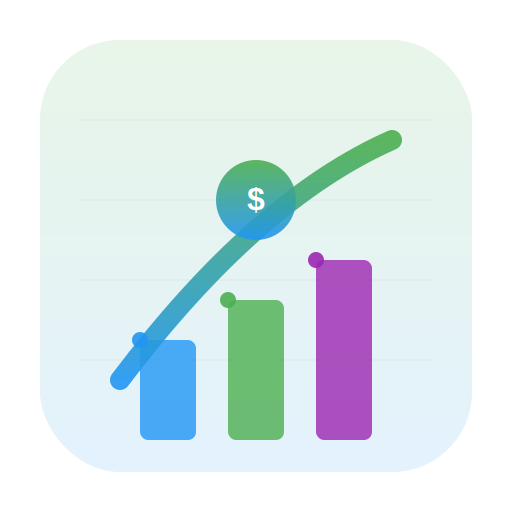

# 💰 Better Finance

A comprehensive personal finance management application built with Next.js, featuring PWA capabilities, Google Sheets integration, and intelligent financial tracking tools.

<!--  -->

## 🌟 Features

### 📊 **Financial Dashboard**
- **Real-time Financial Overview**: Track total assets, account balances, and recent transactions
- **Interactive Cards**: Hide/show sensitive financial information with privacy controls
- **Quick Access**: Navigate to all major features from the main dashboard
- **Responsive Design**: Optimized for mobile-first experience

### 💳 **Account Management**
- **Multi-Account Support**: Track various account types (Wallet, ATM, Platform, etc.)
- **Real-time Balance Updates**: Live balance tracking across all accounts
- **Account Categorization**: Organize accounts by type and importance
- **Balance Comparison**: Compare current vs. previous period balances

### 📈 **Transaction Tracking**
- **Comprehensive Transaction History**: View all financial activities with detailed categorization
- **Advanced Filtering**: Filter by type, account, category, date, and custom criteria
- **Monthly & All-Time Views**: Switch between monthly and comprehensive transaction history
- **Smart Categorization**: Automatic transaction categorization with manual override options

### 💰 **Budget Management**
- **Categorized Budgeting**: Organize budgets into Eating, Living, Saving, Investing, and Giving categories
- **Progress Tracking**: Visual progress bars and percentage completion indicators
- **Budget vs. Actual Analysis**: Compare planned vs. actual spending
- **Weekly Budget System**: Dynamic weekly budget allocation for flexible spending control
- **Hide/Show Controls**: Customize budget visibility for better focus

### 🎯 **Financial Goals**
- **Goal Setting & Tracking**: Set and monitor financial objectives
- **Progress Visualization**: Track goal completion with visual indicators
- **Categorized Goals**: Organize goals by Saving and Investment types
- **Milestone Tracking**: Monitor progress toward financial milestones

### 🏠 **Asset Management**
- **Asset Portfolio**: Track liquid and non-liquid assets
- **Net Worth Calculation**: Comprehensive wealth assessment
- **Asset Categorization**: Organize assets by type and liquidity
- **Portfolio Overview**: Visual representation of asset allocation

### 🔍 **Advanced Features**
- **PWA Support**: Install as a native app on mobile devices
- **Google Sheets Integration**: Seamless data synchronization with Google Sheets
- **Offline Capability**: Access core features without internet connection
- **Data Privacy**: Local storage with optional cloud synchronization
- **Responsive Design**: Optimized for all device sizes

## 🚀 Getting Started

### Prerequisites

- Node.js 18.0 or later
- npm, yarn, pnpm, or bun
- Google Cloud Platform account (for Google Sheets API)
- Google Sheets with proper data structure

### Installation

1. **Clone the repository**
   ```bash
   git clone https://github.com/yourusername/prj-better-finance.git
   cd prj-better-finance
   ```

2. **Install dependencies**
   ```bash
   npm install
   # or
   yarn install
   # or
   pnpm install
   ```

3. **Set up environment variables**
   ```bash
   cp .env.example .env.local
   ```
   
   Configure the following variables in `.env.local`:
   ```env
   NEXT_PUBLIC_APP_URL=http://localhost:3000
   GOOGLE_SHEETS_API_KEY=your_google_sheets_api_key
   GOOGLE_SHEETS_CLIENT_EMAIL=your_service_account_email
   GOOGLE_SHEETS_PRIVATE_KEY=your_private_key
   GOOGLE_SHEETS_SPREADSHEET_ID=your_spreadsheet_id
   ```

4. **Set up Google Sheets API**
   - Create a Google Cloud Project
   - Enable Google Sheets API
   - Create a Service Account
   - Download the service account key
   - Share your Google Sheet with the service account email

5. **Run the development server**
```bash
npm run dev
# or
yarn dev
# or
pnpm dev
# or
bun dev
```

6. **Open your browser**
   Navigate to [http://localhost:3000](http://localhost:3000) to see the application.

<!-- ## 📱 Screenshots

### Dashboard Overview

*Main dashboard showing financial overview, account balances, and recent transactions*

### Transaction Management

*Transaction history with advanced filtering and categorization*

### Budget Tracking

*Budget management with progress tracking and category organization*

### Goals Management

*Financial goals tracking with progress visualization*

### Asset Portfolio

*Asset management and portfolio overview*

### Account Management

*Multi-account balance tracking and management* -->

## 🛠️ Technology Stack

### Frontend
- **Next.js 14** - React framework with App Router
- **React 18** - UI library with hooks and modern features
- **Tailwind CSS** - Utility-first CSS framework
- **SWR** - Data fetching and caching library

### PWA & Mobile
- **next-pwa** - Progressive Web App capabilities
- **Workbox** - Service worker management
- **Responsive Design** - Mobile-first approach

### Data & Integration
- **Google Sheets API** - Data storage and synchronization
- **Google APIs Client** - Google services integration
- **Papa Parse** - CSV data processing

### Development Tools
- **ESLint** - Code linting and quality
- **Prettier** - Code formatting
- **PostCSS** - CSS processing

## 📁 Project Structure

```
prj-better-finance/
├── app/                    # Next.js App Router pages
│   ├── accounts/          # Account management
│   ├── assets/            # Asset tracking
│   ├── budgets/           # Budget management
│   ├── goals/             # Financial goals
│   ├── transactions/      # Transaction history
│   └── settings/          # Application settings
├── components/            # Reusable UI components
│   ├── Card/             # Card components
│   ├── Charts/           # Data visualization
│   ├── FilterDropdown/   # Filter components
│   └── PWA/              # PWA components
├── utils/                 # Utility functions
├── configs/              # Configuration files
├── docs/                 # Documentation
└── public/               # Static assets
```

## 🔧 Available Scripts

- `npm run dev` - Start development server
- `npm run build` - Build for production
- `npm run start` - Start production server
- `npm run lint` - Run ESLint
- `npm run format` - Format code with Prettier
- `npm run build:pwa` - Build with PWA optimization

## 📊 Data Structure

The application integrates with Google Sheets for data storage. Each sheet represents different data types:

- **Transactions** - Monthly transaction data
- **Budgets** - Budget allocation and tracking
- **Goals** - Financial goals and progress
- **Accounts** - Account balances and information
- **Assets** - Asset portfolio data

## 🚀 Deployment

### Vercel (Recommended)
1. Connect your GitHub repository to Vercel
2. Configure environment variables
3. Deploy automatically on push to main branch

### Other Platforms
- **Netlify**: Static site deployment
- **Railway**: Full-stack deployment
- **DigitalOcean**: VPS deployment

## 🤝 Contributing

1. Fork the repository
2. Create a feature branch (`git checkout -b feature/amazing-feature`)
3. Commit your changes (`git commit -m 'Add some amazing feature'`)
4. Push to the branch (`git push origin feature/amazing-feature`)
5. Open a Pull Request

## 📝 License

This project is licensed under the MIT License - see the [LICENSE](LICENSE) file for details.

## 👨‍💻 Author

**Abu Abdirohman**
- GitHub: [@abuabdirohman](https://github.com/abuabdirohman)
- Email: your.email@example.com

## 🙏 Acknowledgments

- Next.js team for the amazing framework
- Tailwind CSS for the utility-first CSS approach
- Google Sheets API for data integration
- All contributors and users of this project

## 📞 Support

If you encounter any issues or have questions:

1. Check the [Issues](https://github.com/yourusername/prj-better-finance/issues) page
2. Create a new issue with detailed description
3. Contact the maintainer directly

---

**Made with ❤️ for better financial management**
